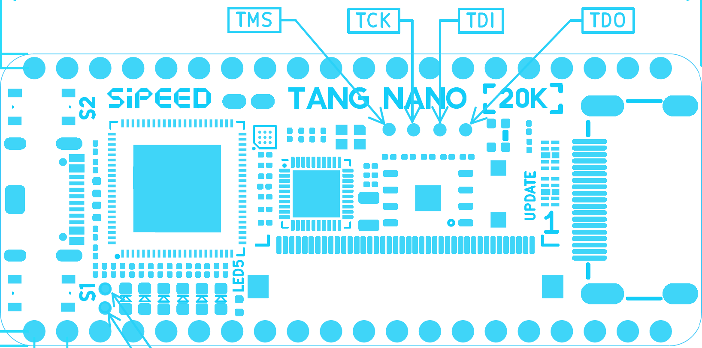
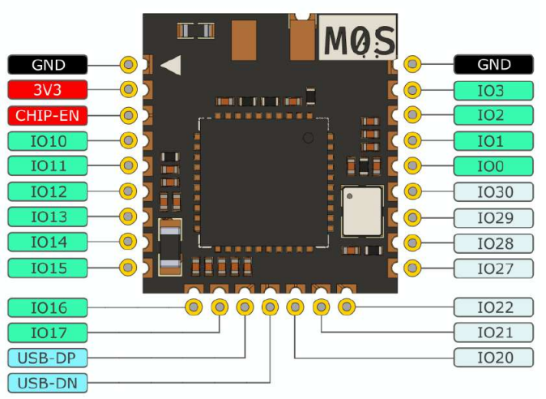

# MiSTle FPGA companion BL616 variant

This is the variant of the FPGA companion firmware for the BL616 MCU.

## Example wiring M0S Dock (BL616 MPU)


|M0S pin|Signal      |BL616 GPIO|Note        |
|--|------------- |--------|--------------|
|20|JTAG TMS[^1]  |GPIO  0 |              |
|21|JTAG TCK[^1]  |GPIO  1 |              |
|22|JTAG TDO[^1]  |GPIO  2 |EN_CHIP BL616 |
|23|JTAG TDI[^1]  |GPIO  3 |              |
||CSN           |GPIO 12 |              |
||SCK           |GPIO 13 |              |
||MISO          |GPIO 10 |              |
||MOSI          |GPIO 11 |              |
||IRQN          |GPIO 14 |              |
||BL616 UART RX |GPIO 21 |              |
||BL616 UART TX |GPIO 22 |              |

[^1]: JTAG FPGA loader

Location JTAG connection TN20k PCBA top side.  



Location GPIO 0...3 for JTAG purposes on M0S sub-module PCBA. M0S Dock top side. 



## Tang integrated onboard BL616 MPU

JTAG signals, UART RX and TX are re-purposed as SPI and control interface. MPU is Master and FPGA is slave. UART RX GPIO is board specific and used as an SPI interrupt input. The UART TX GPIO is a board-specific signal used to control the FPGA’s dedicated JTAG hw pins and determine whether the interface operates in native JTAG or SPI mode. Nano 20k always stays in JTAG active enabled mode as both JTAG and SPI are as dedicated hw pins available.  

**Tang Nano 20k**

|BL616 GPIO    |Nano 20k 3921 |Nano 20k 3923|re-use|Note|
|-----   |------------- |----|--------  |-----|
|GPIO0   |SPI _SS       |SPI _SS|-   |  |
|GPIO1   |SPI SCK       |SPI SCK|-   |  |
|GPIO2   |SPI MISO      |unused|-  | EN_CHIP BL616 |
|GPIO3   |SPI MOSI      |unused|-  |  |
|GPIO 13 |BL616 UART RX |BL616 UART RX|SPI _IRQ  |  |
|GPIO 11 |BL616 UART TX |BL616 UART TX|- | debug console |
|GPIO 16 |JTAG TMS      |JTAG TMS|-   |  |
|GPIO 10 |JTAG TCK      |JTAG TCK |-  |  |
|GPIO 14 |JTAG TDO      |JTAG TDO |-  |  |
|GPIO 12 |JTAG TDI      |JTAG TDI |-  |  |
|GPIO 22 |unused        |unused  |UART RX  | debug console  |
|GPIO 27 |unused        | SPI MOSI   |-  |  |
|GPIO 30 |unused        | SPI MISO   |-  |  |

Nano20k uses default BL616 UART TX for the debug console.  

**Primer / Console / Mega**

|BL616 GPIO|Tang Board wiring BL616|re-use|Note|
|----- |------------- |--------  |-----|
|GPIO0 |JTAG TMS      |SPI _SS   |  |
|GPIO1 |JTAG TCK      |SPI SCK   |  |
|GPIO2 |JTAG TDO      |SPI MISO  | EN_CHIP BL616 |
|GPIO3 |JTAG TDI      |SPI MOSI  |  |
|GPIO x|BL616 UART RX |SPI _IRQ  |  |
|GPIO x|BL616 UART TX |V_JTAGSELN| 1=JTAG, 0=SPI |
|GPIO x|BL616 TWI SCL[^1] |UART TX   | debug console |

[^1]: The extra TWI SCL connection is only available for Console60k/138k and Mega138k Pro.  

Primer25K BL616 debug console can be used after a required hardware modification: remove capacitor C22 to make GPIO12 available at button S3 for debug TX console access. Mega60k can likely re-use GPIO16 or GPIO17 for debug output. 

[All in One Build](#tang-onboard-bl616)

## Compiling and uploading code for the BL616 (Linux)

Download the Bouffalo toolchain:

```bash
git clone https://github.com/bouffalolab/toolchain_gcc_t-head_linux.git
```

and the patched Bouffalo SDK with latest version common CherryUSB Stack:  
```bash
git clone --recurse-submodules https://github.com/MiSTle-Dev/bouffalo_sdk.git
```

Compile the firmware for **M0S Dock**

```bash
git clone --recurse-submodules https://github.com/MiSTle-Dev/FPGA-Companion.git
cd FPGA-Companion
git submodule init
git submodule update
CROSS_COMPILE=<where you downloaded the toolchain>/toolchain_gcc_t-head_linux/bin/riscv64-unknown-elf- BL_SDK_BASE=<where you downloaded the sdk>/bouffalo_sdk/ make
```

for a specific board select in between: m0sdock nano20k console60k mega60k mega138kpro primer25k

```shell
BL_SDK_BASE=<where you downloaded the sdk>/bouffalo_sdk/ make TANG_BOARD=console60k
```

You can simplify the ```make``` a bit by setting in your bashrc BL_SDK_BASE and include the toolchain_gcc_t-head_linux in the search path.

```bash
nano ./bashrc
export BL_SDK_BASE=xyz 
PATH=$PATH:/abc/toolchain_gcc_t-head_linux/bin
```

A simple make or make CHIP=bl616 COMX=/dev/ttyACMxyz flash in your bl616 folder will do then.

for onboard BL616 see: [Windows 11 Build AiO](#tang-onboard-bl616)

### Flashing the firmware

The resulting binary can be flashed onto the M0S. If you don't have
further debugger or prorgammer hardware connected to the M0S Dock, then
you need to perform the following manual steps:

First, you need to unplug the M0S from USB, press the BOOT button and plug the M0S Dock back into the PCs USB with the
BOOT button still pressed. Once connected release the BOOT button. The device
should now be in bootloader mode and show up with its bootloader on the PC:

```bash
$ lsusb
...
Bus 002 Device 009: ID 349b:6160 Bouffalo Bouffalo CDC DEMO
...
```

Also an ACM port should have been created for this device as e.g.
reported in the kernel logs visible with ```dmesg```:

```text
usb 2-1.7.3.3: new high-speed USB device number 9 using ehci-pci
usb 2-1.7.3.3: config 1 interface 0 altsetting 0 endpoint 0x83 has an invalid bInterval 0, changing to 7
usb 2-1.7.3.3: New USB device found, idVendor=349b, idProduct=6160, bcdDevice= 2.00
usb 2-1.7.3.3: New USB device strings: Mfr=1, Product=2, SerialNumber=0
usb 2-1.7.3.3: Product: Bouffalo CDC DEMO
usb 2-1.7.3.3: Manufacturer: Bouffalo
cdc_acm 2-1.7.3.3:1.0: ttyACM3: USB ACM device
```

Once it shows up that way it can be flashed.  
If you have built the firmware yourself and have the SDK installed you can simply enter the following command:

```bash
BL_SDK_BASE=<where you downloaded the sdk>/bouffalo_sdk/ make CHIP=bl616 COMX=/dev/ttyACM3 flash
```

If you have downloaded the firmware from the [release page](https://github.com/MiSTle-Dev/FPGA-Companion/releases) you can use the graphical [BLFlashCube](https://github.com/CherryUSB/bouffalo_sdk/tree/master/tools/bflb_tools/bouffalo_flash_cube) tool using the ```fpga_companion_bl616_cfg.ini``` file.

or alternatively for the .ini file including the companion fw and the fpga-companion:

```shell
BLFlashCube-ubuntu --interface=uart --baudrate=2000000 --port=/dev/ttyACMtbd --chipname=bl616 --cpu_id= --config buildall/flash_nano20k.ini
```

After successful download you need to unplug the device again and reinsert it *without* the BOOT button pressed to boot into the newly installed firmware.

## Compiling and uploading code for the BL616 (Windows 11)

**Looks that recent SDK build still need a [patch](https://github.com/bouffalolab/bouffalo_sdk/issues/236) for Windows or use alternatively Linux instead.**

```shell
cmake/compiler_flags.cmake
sdk_add_link_options
 -flto
 to
 -fno-lto
 ```

Install [Git for Windows](https://gitforwindows.org)

Install [cmake for Windows](https://cmake.org/download)

Install Bouffalo RISC-V MCU toolchain

```shell
Open Start Search, type “cmd” or Win + R and type “cmd” 

cd %HOMEPATH%
git clone https://github.com/bouffalolab/toolchain_gcc_t-head_windows.git
```

and the patched Bouffalo SDK with latest version common CherryUSB Stack:  

```shell
cd %HOMEPATH%
git clone --recurse-submodules https://github.com/MiSTle-Dev/bouffalo_sdk.git
```

Set Windows SDK Environment Variable:  

```text
Open Start Search, type “env”, and select “Edit the system environment variables”.  
  
BL_SDK_BASE=C:\Users\xyzuser\bouffalo_sdk
```

Set Windows search PATH for Toolchain:  

```shell
C:\Users\xyzuser\toolchain_gcc_t-head_windows\bin
C:\Users\xyzuser\bouffalo_sdk\tools\make
C:\Users\xyzuser\bouffalo_sdk\tools\ninja
```

Close shell

```shell
exit
```

Open Start Search, type “cmd” or Win + R and type “cmd”  
check individually proper start of each single tool

```shell
make -v
cmake -version
ninja --help
riscv64-unknown-elf-gcc -v
```

Download FPGA companion repository

```shell
cd %HOMEPATH%/Documents
git clone --recurse-submodules https://github.com/MiSTle-Dev/FPGA-Companion.git
cd FPGA-Companion
git submodule init
git submodule update
```

Compile the firmware for **M0S Dock**  

```shell
cd %HOMEPATH%/Documents\FPGA-Companion\src\bl616
make clean
make
```

for a specific board select in between: m0sdock nano20k console60k mega60k mega138kpro primer25k

```shell
make TANG_BOARD=console60k
```

## tang onboard bl616

A build script creates for the several setups specific binaries and .ini files including the needed ``bl616_fpga_partner_`` firmware. The ``buildall`` folder will contain all needed files for a release. So far Nano20k, Console60k, Console138k, Primer25k, Mega138k Pro, Mega NEO Dock 60k apart from M0S Dock are supported.  
Primer20k and TN9k are excluded as their BL702 doesn't support required USB host mode.

```shell
buildall.bat
buildall.sh
```

### Flashing the firmware M0S Dock

First, you need to unplug the M0S_DOCK from USB, press the BOOT button and plug the M0S Dock back into the PCs USB with the
BOOT button still pressed. Once connected release the BOOT button. The device
should now be in bootloader mode and show up with its bootloader on the PC.

Figure out MPU bootloader COM port and use shell command to program:  
Press Windows + R keyboard shortcut to launch the Windows Run box, type “devmgmt.msc” , and click the OK button.  

Device Manager will open.  
Locate Ports (COM & LPT) in the list.  
Check for the COM ports by expanding the same.  

```shell
make CHIP=bl616 COMX=COMabc  flash
```

If you have downloaded the firmware from the [release page](https://github.com/MiSTle-Dev/FPGA-Companion/releases) you can use the graphical [BLFlashCube](https://github.com/CherryUSB/bouffalo_sdk/tree/master/tools/bflb_tools/bouffalo_flash_cube) tool using the ```fpga_companion_bl616_cfg.ini``` file.

or alternatively a shell based tool:

```shell
cd %HOMEPATH%/Documents\FPGA-Companion\src\bl616
BLFlashCommand.exe --interface=uart --baudrate=2000000 --port=COM_tbd --chipname=bl616 --cpu_id= --config %HOMEPATH%/Documents\FPGA-Companion\src\bl616\buildall\flash_nano20k.ini
```

After successful download you need to unplug the device again and reinsert it *without* the BOOT button pressed to boot into the newly installed firmware.
